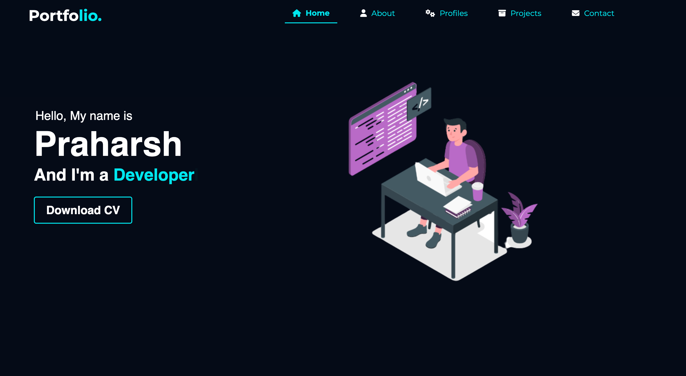
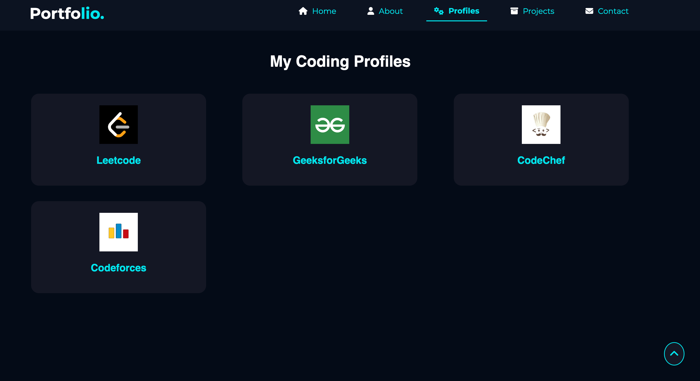
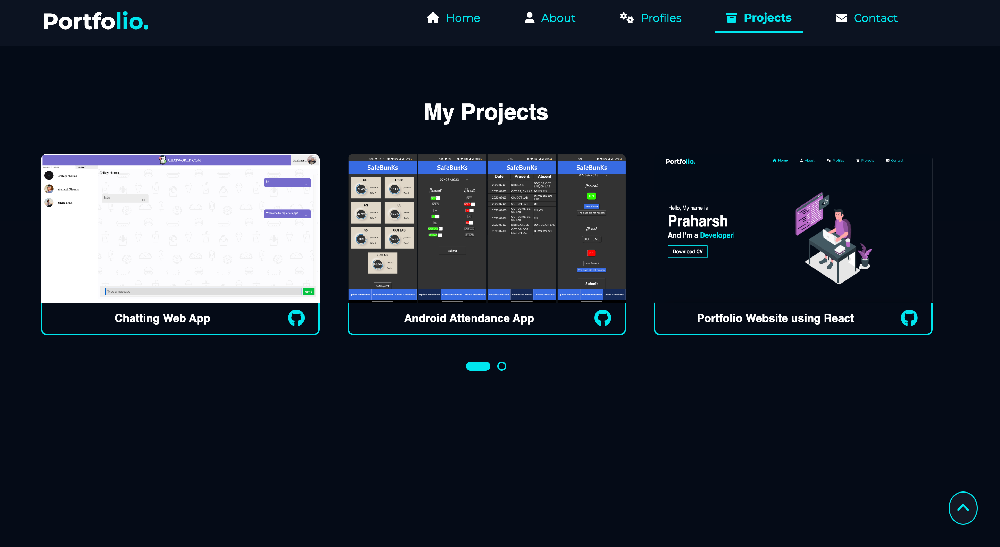

# Portfolio Website

# 🧭 Table of contents

- [Portfolio Website](#portfolio-website)
- [🧭 Table of contents](#-table-of-contents)
- [Introduction](#introduction)
- [Quick Start](#quick-start)
- [About](#about)
- [Deployment](#deployment)


# Introduction

Welcome to my portfolio website! This website, built using React, showcases my work, skills, and experiences.


<br><br>
<br><br>
<br>

# Quick Start 

📄 Clone or fork this repo :
`https://github.com/praharshsharma/myportfolio.git`:

```sh
git clone https://github.com/praharshsharma/myportfolio.git
```

💿 Install all dependencies:

```sh
npm install
```

🚴‍♂️ Run your App:

```sh

npm start

```
It runs on the browser with localhost 3000.
```sh
http://localhost:3000/
```

# About

This project was built using `React`, a popular JavaScript library for building user interfaces. 
The website was designed by breaking down the different parts of the page into reusable `components`. 
Each component focuses on a specific functionality or section, allowing for easy maintenance and scalability.

The `useEffect` hooks in React is used to handle any necessary side effects within these components. 
Additionally, the `AOS(Animate On Scroll)` library of CSS is incorporated to add captivating scrolling effects to enhance the user experience. 


# Deployment

The website was deployed using `Netlify`

link : https://praharshsharma.netlify.app/


 
